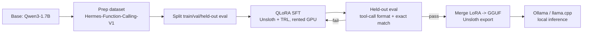

# First Homemade LLM — QLoRA Tool-Use Fine-Tune

Status: Approved
Date: 2026-08-07

## Goal

Fine-tune the smallest capable open-weight instruct model to reliably use
tools, via QLoRA on a rented GPU, then run it fully offline via
llama.cpp/Ollama. This is a first, practically-usable homemade LLM — success
means: coherent general chat, and correctly-formatted tool calls when a tool
is appropriate.

## Non-goals

- Pretraining from scratch.
- Serving via a hosted API / vLLM (deployment target is local GGUF only).
- Multi-turn agent orchestration / actually executing tool calls end-to-end
  (this project produces a model that *emits* correct tool calls; wiring it
  into an agent loop is a separate future project).

## Architecture



## Components

### Base model

`Qwen/Qwen3-1.7B` — latest Qwen generation (supersedes Qwen2.5), 1.7B params,
28 layers, GQA, 32k context. Confirmed via HF model card to natively support
agentic tool calling (`apply_chat_template(tools=...)`, emits
`<tool_call>{"name": ..., "arguments": ...}</tool_call>`), which matches the
tag convention used by the training dataset. Qwen3 has a thinking/non-thinking
mode switch (`enable_thinking`); since the training dataset has no `<think>`
blocks, all training and inference in this project targets non-thinking mode
(`enable_thinking=False`) to avoid teaching an off-distribution/broken
thinking format. 0.6B was considered and rejected — tool-call adherence
degrades too much at that size for a first working pipeline.

### Dataset

`NousResearch/hermes-function-calling-v1` from Hugging Face, pinned to a
specific revision hash in `configs/train.yaml`. Reformatted through the
Qwen3 chat template (system + tools schema + turns), producing training
examples that end in either a plain assistant reply or a `<tool_call>` block.

Split: 90% train / 5% val (used for checkpoint selection during training) /
5% held-out eval (never seen until the final eval step). Split is stratified
by example type (plain-chat vs tool-call) so both splits and the eval set
retain a representative mix.

### Training

Unsloth `FastLanguageModel` + TRL `SFTTrainer`, 4-bit QLoRA, single rented
GPU (RunPod/Lambda, ~24GB class, e.g. A10/3090-tier — comfortably fits a
1.7B QLoRA run with headroom for tool-call-length contexts).

Config-driven via `configs/train.yaml`: LoRA rank/alpha/dropout, target
modules, learning rate, epochs, max sequence length, batch size, gradient
accumulation, checkpoint interval.

Resilience: checkpoints saved every N steps; training entrypoint resumes
from the latest checkpoint if interrupted (rented GPU sessions can be
preempted or manually stopped to save cost).

### Evaluation

Held-out split scored by `src/llm_internal/eval/run_eval.py`:

- **Plain-chat examples**: response scored for basic coherence /
  reasonable-length non-empty output (sanity check, not the primary metric
  — chat quality is inherently fuzzy).
- **Tool-call examples**: the emitted `<tool_call>` block is parsed as JSON
  and scored for structural accuracy — correct function name, correct
  argument key set, correct argument values (exact match on primitives).
  This is the primary metric.

Thresholds fixed in `configs/eval.yaml` (e.g. ≥80% tool-call structural
accuracy). The eval script exits non-zero if any threshold is missed, which
gates the export step — a failing checkpoint is never merged/exported.

### Export / deployment

Unsloth's built-in `save_pretrained_gguf` merges the LoRA adapter into the
base model and quantizes in one call (starting quantization: `q4_k_m`).
Output includes a generated `Modelfile` for `ollama create`, giving fully
offline local inference — no ongoing cloud/API cost after training.

## Repo layout

```
pyproject.toml            # uv-managed: torch, unsloth, trl, peft, transformers, datasets
configs/
  train.yaml               # model id, LoRA/QLoRA hyperparams, dataset revision
  eval.yaml                # eval thresholds
src/llm_internal/
  data/prepare.py          # download + format (Qwen3 chat template) + split
  train/sft.py             # Unsloth+TRL QLoRA training entrypoint (resumable)
  eval/run_eval.py         # held-out metrics, gates export
  export/to_gguf.py        # merge LoRA + quantize + write Modelfile
scripts/
  run_on_runpod.sh          # remote GPU provisioning helper/notes
docs/superpowers/specs/
  2026-08-07-homemade-llm-design.md
```

## Error handling / risks

- Rented GPU cost: training checkpoints/resumes to tolerate interruption
  without re-paying for full re-runs.
- Never export/deploy a checkpoint that fails the held-out eval gate.
- Dataset revision is pinned to guard against upstream format drift breaking
  the chat-template mapping silently.
- Qwen3 thinking-mode leakage: training explicitly forces
  `enable_thinking=False` on every formatted example to keep behavior
  on-distribution; eval also runs the model with `enable_thinking=False`.

## Testing / verification plan

- `data/prepare.py`: spot-check a handful of formatted examples render valid
  chat-template text and valid `<tool_call>` JSON where expected.
- `train/sft.py`: smoke run on a tiny subset (few dozen examples, 1 step) to
  confirm the training loop runs end-to-end on the rented GPU before
  committing to a full run.
- `eval/run_eval.py`: the held-out gate itself is the acceptance test for
  the fine-tune; run against the trained checkpoint and report metrics.
- `export/to_gguf.py`: after export, manually chat with the model via
  `ollama run` and issue 2–3 tool-eligible prompts to visually confirm
  correct `<tool_call>` emission end-to-end (matches the local deployment
  target).
