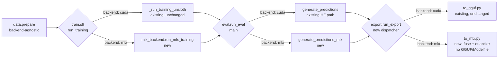

# MLX Backend Support for QLoRA Fine-Tune

Status: Approved
Date: 2026-08-07

## Goal

Add Apple Silicon (MLX) as a second training/eval/export backend alongside
the existing CUDA/Unsloth backend, so the pipeline in
`docs/superpowers/specs/2026-08-07-homemade-llm-design.md` can be run
end-to-end on a Mac instead of (or in addition to) a rented GPU.

## Non-goals

- Unifying the two backends' export artifacts. GGUF (CUDA path) and an MLX
  weights directory (MLX path) are genuinely different deliverables — no
  attempt is made to make one produce the other.
- Making `mlx-lm` emit GGUF for Qwen3. It can't: `mlx_lm.fuse
  --export-gguf` is F16-only and restricted to `llama`/`mixtral`/`mistral`
  model types (confirmed from `mlx_lm/gguf.py` and `mlx_lm/fuse.py` source).
  Quantized GGUF for a Qwen3 checkpoint remains the CUDA/Unsloth path's job.
- CI or hardware to exercise the MLX path in this repo's test suite. This
  workstation is Linux/no-Metal; the `mlx` package only builds on Apple
  Silicon macOS. MLX-only functions are implemented for real but verified
  by inspection/type-correctness here, the same posture the CUDA-only path
  (`run_training`, `merge_and_quantize`) already has on this workstation.
- Distributing/serving the MLX output beyond documenting the `mlx_lm`
  commands to run it (`mlx_lm.generate` / `mlx_lm.server`).

## Key technical constraint (from source research on `mlx-lm` 0.31.3)

`mlx_lm.lora`'s `ChatDataset` calls `tokenizer.apply_chat_template(...)`
without passing `enable_thinking`, so mlx-lm's wrapper always injects
`enable_thinking=True` for Qwen3 during **training** data templating — with
no config/CLI override on that code path (the override only exists on
`mlx_lm.generate`/`server`/`evaluate` via `--chat-template-args`). This
directly conflicts with the project's non-thinking-mode constraint.

**Resolution:** never let mlx-lm apply the chat template for training data.
Pre-render each conversation to plain text ourselves, reusing the
already-tested `build_training_text(messages, tokenizer)` from
`train/sft.py` (full-conversation render, `add_generation_prompt=False` —
the same code path already used for the CUDA backend, where
`enable_thinking` is a no-op per Task 5's finding). Feed mlx-lm the `text`
dataset format (`{"text": ...}` per line), not the `chat` format. For
**inference** (eval), `enable_thinking=False` is passed explicitly via
`chat_template_args`, which mlx-lm does support there.

## Architecture



Data prep (`data/prepare.py`) and eval scoring (`eval/scoring.py`,
`evaluate_examples`) are untouched — they operate on plain
messages/predictions and know nothing about backends. Only model
loading/generation (train, eval-generate, export) forks on `backend`.

## Components

### Dependencies

`pyproject.toml` gains an optional-dependency group:

```toml
[project.optional-dependencies]
dev = ["pytest>=8.0"]
mlx = ["mlx-lm>=0.31.3"]
```

Not part of the default/dev install — `mlx` (the native package `mlx-lm`
depends on) only has wheels for Apple Silicon macOS and would break `uv
sync` here. Mac users run `uv sync --extra dev --extra mlx`.

### `train/config.py`

`TrainConfig` gains:
- `backend: str` — validated in `__post_init__` to be `"cuda"` or `"mlx"`
  (raises `ValueError` otherwise, same style as the existing
  `enable_thinking` check).
- `mlx_num_layers: int` — which of the last N transformer blocks get LoRA
  adapters in mlx-lm; `-1` means all layers (mirrors Unsloth, which applies
  LoRA to every layer matching `target_modules`).

No duplicated hyperparameters: MLX's `scale` and `keys` are *derived* from
the existing `lora_alpha`/`lora_r`/`target_modules` fields (see below), not
new independent config values that could drift from the CUDA config.

`configs/train.yaml` adds `backend: cuda` and `mlx_num_layers: -1` (both
required fields, matching the dataclass — no silent defaults, consistent
with every other field in this config).

### `train/mlx_backend.py` (new)

Pure/testable (no `mlx` import needed):
- `lora_scale(lora_alpha: int, lora_r: int) -> float` — mlx-lm has no
  `alpha` concept; it applies `scale` directly, where PEFT/Unsloth compute
  `scale = alpha / r` internally. This function makes that translation
  explicit and testable, so both backends have equivalent effective LoRA
  magnitude for the same `lora_alpha`/`lora_r` config.
- `target_modules_to_mlx_keys(target_modules: list[str]) -> list[str]` —
  maps bare HF module names to mlx-lm's block-relative paths:
  `q_proj/k_proj/v_proj/o_proj` → `self_attn.<name>`,
  `gate_proj/up_proj/down_proj` → `mlp.<name>`. Raises `ValueError` on an
  unrecognized module name (fail loud on a config typo, not silently
  drop it).
- `build_mlx_lora_config(cfg: TrainConfig) -> dict` — returns mlx-lm's
  `lora_parameters` shape: `{"rank": cfg.lora_r, "scale": lora_scale(...),
  "dropout": cfg.lora_dropout, "keys": target_modules_to_mlx_keys(...)}`.
- `compute_mlx_iters(num_examples: int, batch_size: int, epochs: int) ->
  int` — mlx-lm trains for a step count (`iters`), not epochs; this
  converts `cfg.epochs` at a given batch size into the equivalent step
  count (`ceil(num_examples / batch_size) * epochs`), so the two backends
  train for a comparable amount of data.
- `export_data_for_mlx(data_dir: Path, tokenizer, out_dir: Path) -> None`
  — reads `train.jsonl`/`val.jsonl` (existing `data/prepare.py` output),
  renders each example via `build_training_text` (imported from
  `train/sft.py`, not reimplemented), writes mlx-lm's expected files:
  `out_dir/train.jsonl` and `out_dir/valid.jsonl` (mlx-lm requires the name
  `valid`, not `val`), each line `{"text": rendered}`.

Metal-only (lazy `import mlx_lm` inside the function body, same pattern as
`run_training`'s lazy `unsloth`/`trl` imports):
- `run_mlx_training(cfg: TrainConfig) -> None` — (1) quantize the base
  model to a local MLX 4-bit copy via `mlx_lm.convert.convert(cfg.base_model,
  mlx_path=<cfg.output_dir>/mlx_base, quantize=True, q_bits=4)` — this
  quantized-base-plus-adapter *is* mlx-lm's QLoRA (confirmed: `LoRALinear.from_base`
  detects `nn.QuantizedLinear` and trains adapters on top of it; there is
  no separate QLoRA flag); (2) `export_data_for_mlx(...)` into
  `<cfg.output_dir>/mlx_data`; (3) build the `mlx_lm.lora` args namespace
  (`model`, `data`, `adapter_path=cfg.output_dir`, `iters` from
  `compute_mlx_iters`, `batch_size=cfg.per_device_train_batch_size`,
  `learning_rate=cfg.learning_rate`, `max_seq_length=cfg.max_seq_length`,
  `lora_parameters=build_mlx_lora_config(cfg)`, `num_layers=cfg.mlx_num_layers`,
  `seed=cfg.seed`, `train=True`) and call `mlx_lm.lora.run(args)`.

### `train/sft.py`

`run_training(cfg)` becomes a dispatcher:

```python
def run_training(cfg: TrainConfig) -> None:
    if cfg.backend == "mlx":
        from llm_internal.train.mlx_backend import run_mlx_training
        run_mlx_training(cfg)
    else:
        _run_training_unsloth(cfg)
```

The existing Unsloth body moves verbatim into `_run_training_unsloth(cfg)`
— no behavior change to the CUDA path.

### `eval/config.py` / `eval/run_eval.py`

`EvalConfig` gains `backend: str`, validated the same way. `configs/eval.yaml`
adds `backend: cuda`.

New in `run_eval.py`:
- `generate_predictions_mlx(examples: list[dict], model_dir: str, cfg:
  EvalConfig) -> list[str]` — Metal-only, lazy `mlx_lm` import. Loads via
  `mlx_lm.load(model_dir, adapter_path=...)` if an adapter is present, else
  loads the fused model directly; for each example renders the prompt
  (all messages except the final assistant turn) and calls
  `mlx_lm.generate.generate(model, tokenizer, prompt=...,
  max_tokens=cfg.max_new_tokens)` with the tokenizer's chat template
  invoked with `chat_template_args={"enable_thinking": False}` — this
  override is supported on the generate path (unlike training), per the
  `--chat-template-args` CLI flag mlx-lm exposes on `generate`/`server`/
  `evaluate`.

`main()` dispatches:

```python
if cfg.backend == "mlx":
    predictions = generate_predictions_mlx(examples, cfg.model_dir, cfg)
else:
    tokenizer = AutoTokenizer.from_pretrained(cfg.model_dir)
    model = AutoModelForCausalLM.from_pretrained(cfg.model_dir, device_map="auto")
    predictions = generate_predictions(examples, model, tokenizer, cfg)
report = evaluate_examples(examples, predictions, cfg)
```

`evaluate_examples` (pure scoring) is untouched — already backend-agnostic.

### `export/config.py` + `configs/export.yaml` (new)

`to_gguf.py` currently has no config file; its `main()` reads
`configs/train.yaml` just for `output_dir` and hardcodes the rest. This
was fine for a single backend but doesn't extend cleanly, so export gets
its own config, matching the `data`/`train`/`eval` pattern:

```python
@dataclasses.dataclass
class ExportConfig:
    backend: str          # "cuda" | "mlx"
    model_dir: str         # trained checkpoint/adapter dir
    output_dir: str
    quant: str              # "q4_k_m" for cuda; "4bit"/"8bit" for mlx
```

```yaml
# configs/export.yaml
backend: cuda
model_dir: checkpoints
output_dir: export
quant: q4_k_m
```

### `export/to_mlx.py` (new)

Pure: `render_mlx_readme(output_dir: str) -> str` — there is no MLX
equivalent of a Modelfile; this documents the two `mlx_lm` commands to run
the exported model (`mlx_lm.generate --model <output_dir> --chat-template-args
'{"enable_thinking":false}'` and `mlx_lm.server --model <output_dir>`).
`write_readme(path: str | Path, content: str) -> None` writes it to disk
(same shape as `to_gguf.py`'s `write_modelfile`).

Metal-only: `fuse_and_quantize_mlx(model_dir: str, output_dir: str, q_bits:
int = 4) -> Path` — lazy `mlx_lm` import; loads the base + adapter, fuses
every module with a `.fuse()` method (mirrors `mlx_lm.fuse`'s own logic,
called as library functions rather than shelling out to its CLI, since
`mlx_lm.fuse.main()` is argv-only), then quantizes via
`mlx_lm.convert.convert(..., quantize=True, q_bits=q_bits)` and
`mlx_lm.utils.save(...)`. Returns the output directory path.

### `export/run_export.py` (new dispatcher CLI)

```python
def main() -> None:
    cfg = load_export_config("configs/export.yaml")
    if cfg.backend == "mlx":
        from llm_internal.export.to_mlx import fuse_and_quantize_mlx, render_mlx_readme, write_readme
        out = fuse_and_quantize_mlx(cfg.model_dir, cfg.output_dir)
        write_readme(Path(cfg.output_dir) / "README.md", render_mlx_readme(cfg.output_dir))
    else:
        from llm_internal.export.to_gguf import merge_and_quantize, render_modelfile, write_modelfile
        gguf_path = merge_and_quantize(cfg.model_dir, cfg.output_dir, cfg.quant)
        write_modelfile(Path(cfg.output_dir) / "Modelfile", render_modelfile(gguf_path.name))
    print(f"exported ({cfg.backend}) to {cfg.output_dir}")
```

`to_gguf.py`'s own `main()` (reads `configs/train.yaml` directly) is left
in place unchanged for direct CUDA-only invocation —
`export/run_export.py` is the new config-driven entrypoint that both
backends go through; `python -m llm_internal.export.to_gguf` still works
standalone.

### `scripts/run_on_mac_mlx.sh` (new)

Mirrors `scripts/run_on_runpod.sh` for the MLX path:

```bash
#!/usr/bin/env bash
set -euo pipefail
cd "$(dirname "$0")/.."
echo "[1/5] Installing dependencies (incl. mlx-lm)..."
uv sync --extra dev --extra mlx
echo "[2/5] Preparing dataset..."
uv run python -m llm_internal.data.prepare
echo "[3/5] Running MLX QLoRA fine-tune..."
uv run python -m llm_internal.train.sft
echo "[4/5] Running held-out eval gate..."
if ! uv run python -m llm_internal.eval.run_eval; then
    echo "Eval gate failed -- checkpoint not exported." >&2
    exit 1
fi
echo "[5/5] Exporting fused + quantized MLX model..."
uv run python -m llm_internal.export.run_export
echo "Done. See export/README.md for how to run it (mlx_lm.generate / mlx_lm.server)."
```

Assumes `configs/train.yaml`/`eval.yaml`/`export.yaml` already have
`backend: mlx` set (a config edit, not a script flag — keeps the script
identical in spirit to `run_on_runpod.sh`, which also assumes the configs
are already correct for its target).

### README

Adds a "Backends" section documenting `backend: cuda` (rented GPU,
`scripts/run_on_runpod.sh`, GGUF/Ollama output) vs `backend: mlx` (Apple
Silicon, `scripts/run_on_mac_mlx.sh`, MLX-directory output served via
`mlx_lm`).

## Data flow (MLX path only; CUDA path unchanged)

1. `data.prepare` → `data/processed/{train,val,eval}.jsonl` (unchanged,
   backend-agnostic).
2. `train.sft.run_training` (backend=mlx) → `mlx_backend.run_mlx_training`:
   quantizes base to `checkpoints/mlx_base/`, renders
   `data/processed/{train,val}.jsonl` to `checkpoints/mlx_data/{train,valid}.jsonl`
   via `build_training_text`, runs `mlx_lm.lora.run`, writes
   `checkpoints/adapters.safetensors` + `adapter_config.json`.
3. `eval.run_eval.main` (backend=mlx) → loads `checkpoints/mlx_base` +
   adapter, generates predictions with `enable_thinking=False`, scores via
   the same `evaluate_examples`/`aggregate_results` as the CUDA path, gates
   export identically.
4. `export.run_export.main` (backend=mlx) → fuses adapter into base,
   quantizes, writes `export/` (safetensors + config.json + tokenizer +
   README.md).

## Error handling

- `TrainConfig`/`EvalConfig`/`ExportConfig` reject any `backend` other than
  `"cuda"`/`"mlx"` at load time (fail fast on a config typo, not deep into
  a training run).
- `target_modules_to_mlx_keys` raises on an unrecognized module name rather
  than silently dropping it — a silently-incomplete LoRA target set would
  be a hard-to-notice training-quality bug.
- `run_mlx_training`/`fuse_and_quantize_mlx`/`generate_predictions_mlx`
  lazy-import `mlx_lm` inside the function body (not at module top), so
  importing `llm_internal.train.mlx_backend` or `llm_internal.export.to_mlx`
  never fails on a non-macOS machine — only calling the Metal-only
  functions does. This matches the existing `unsloth`/`trl` lazy-import
  convention.

## Testing plan

Every pure function listed above gets a real unit test, same TDD style as
the rest of the project:
- `lora_scale`, `target_modules_to_mlx_keys` (incl. the `ValueError` on an
  unknown module), `build_mlx_lora_config`, `compute_mlx_iters`.
- `export_data_for_mlx` — tested with a real downloaded Qwen3-1.7B
  tokenizer (no `mlx` install needed), same fixture pattern as
  `tests/train/test_sft.py`; asserts `train.jsonl`/`valid.jsonl` (not
  `val.jsonl`) exist with `{"text": ...}` lines containing rendered
  `<|im_start|>` content.
- `render_mlx_readme` — string-content assertions, same pattern as
  `render_modelfile`.
- `ExportConfig`/`load_export_config` — reads the real `configs/export.yaml`.
- Dispatcher coverage (new, doesn't exist for the CUDA-only path today):
  `run_training`, `run_eval.main`, `run_export.main` each get a test that
  monkeypatches both backend implementations and asserts the correct one
  is called for `backend="cuda"` vs `backend="mlx"`, without needing torch,
  unsloth, or mlx installed.

`run_mlx_training`, `fuse_and_quantize_mlx`, `generate_predictions_mlx`
are implemented for real per this spec but are **not** exercised by the
local test suite (no Apple Silicon on this workstation) — identical
posture to `run_training`/`merge_and_quantize`/GPU-`generate_predictions`
on the CUDA side today. They are exercised via `scripts/run_on_mac_mlx.sh`
on real Apple Silicon hardware, the same way the CUDA path is exercised on
a rented GPU via `scripts/run_on_runpod.sh`.
